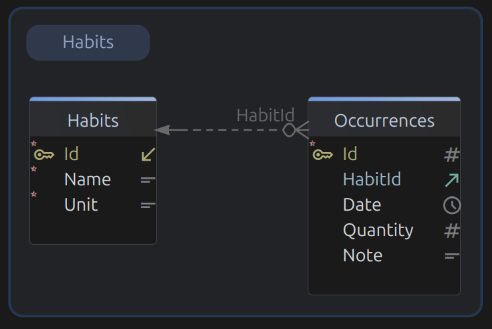
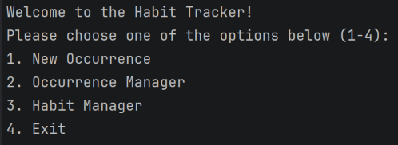

# Building a habit tracker

This is my second C# application using JetBrains Rider - a console based CRUD application to track hobbies and their occurrences.

### So, what does this application do?

It logs the occurrences of a habit of the user. It logs the date, the quantity, and any notes that the user wants to put in the occurrence.

### Features
#### Database
- This program uses a SQLite database to store and read information.
- When this app starts, it will create a database, if one doesn't present.
- The database diagram:

	
	- In this diagram:
		- Habits:
			- Id: Self-assigned IDs for habits
			- Name: Habit name
			- Unit: Habit's unit of measurement. Each habit is tied to one unit.
	
		- Occurrences:
			- Id: Self-assigned IDs for occurrences
			- HabitId: Assigned habit for this occurence, by ID
			- Date: Date of occurrence
			- Quantity: e.g. 4 cups of water, etc.
			- Note: Optional for the occurrence

#### User Interface
- This program runs inside a command-line window where users can navigate by key presses
	


#### Occurrence Manager
- Here, the user will be greeted with a lists of recorded occurrences of habits, with options to create, edit or delete an occurrence.
- TODO: Put the occurrence menu here


#### Habit Manager
- Same as occurrence manager, the user will also be able to read, create, edit or delete a habit.
- TODO: Put the habit menu here

### What was hard? 
- I had never learned SQLite before (although I learned about SQL), let alone using C# to interact with it. I had to learn about those interactions to perform CRUD operations.

- Ensuring great user experience is also hard. 
	- A good example in this project is that when re-prompting the user for the correct input after many incorrect ones, the previous prompt in the form will be hidden by many re-prompt messages.

```
What is the name of the new habit?
> Drinking water

What is the unit of measurement for this habit?
This can't be empty. Please try again.

What is the unit of measurement for this habit?
This can't be empty. Please try again.

What is the unit of measurement for this habit?
This can't be empty. Please try again.

What is the unit of measurement for this habit?
This can't be empty. Please try again.

... <The first question will be hidden as you scroll down the terminal>
```

- Because of that, I tried looking up and learned about the terminal canvas as a grid, having rows and columns. By using `Console.CursorTop` and `Console.SetCursorPosition()`, we can change the cursor position after certain conditions. Also I learned about `Console.WindowWidth` that helped me overwrite the wrong input with white-spaces with the length of the terminal window's width, clearing the line.

```
What is the name of the new habit?              -----> Fixed at the first line
                                                -----> Fixed at the second line
> Drinking water                                -----> Starts from the third line

What is the unit of measurement for this habit? -----> Fixed at the first line
This can't be empty. Please try again.          -----> Fixed at the second line
<input line>                                    -----> Starts from the third line

<The user put in an invalid input many times>
```

- Using the new methods above made me fix the lines, making them either appear or disappear. This helps the user check if they accidentally input an unwanted hobby in the first question. I know this is a bit over-engineered, not the best solution with the empty second line when there are no invalid inputs, and there are TUI libraries and frameworks out there that makes this easier, but I am really proud of the new things I learned here :D

- Separation of Concerns. This is pretty hard for me to keep in mind throughout the whole project, and sometimes I put too many responsibilities into one class, for example I once made the repository also display the error messages intended for the user to the terminal instead of having that functionality in the UI class. This can be a problem if I were to work on large enterprise stuff in the future.


### What have I learned?
- New methods for editing the terminal UI, as mentioned above. I am a bit annoyed with the UX, so I looked up ways to improve it, learning new methods and libraries on the way.
- Designing databases using tools. The database image above in this document is designed using [DbSchema](https://dbschema.com/), and even though this project is small, I believe this is a very important skill set for my future career. I also am building myself another project, so yes.
- 

### What can I improve?

### Resources Used
- SQLite resources from https://www.sqlitetutorial.net/sqlite-csharp
- 
